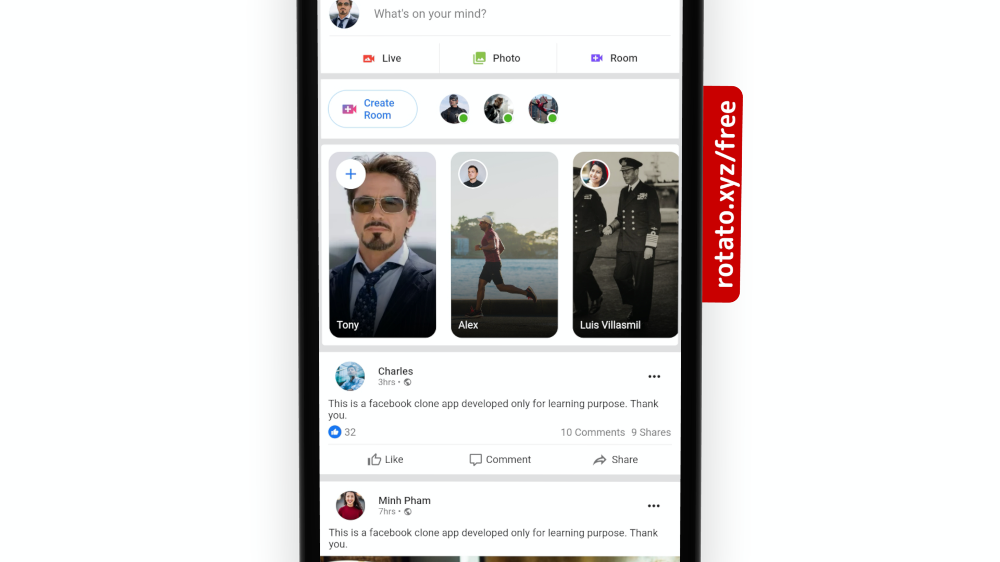
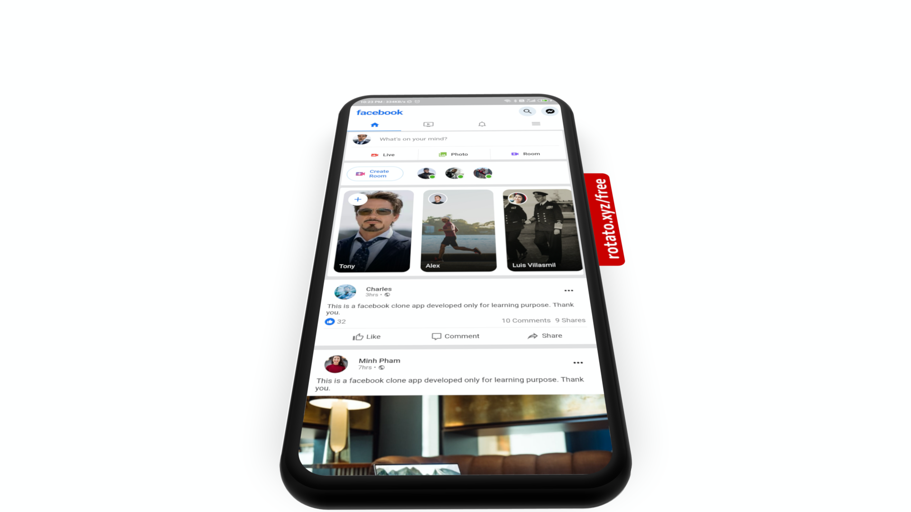
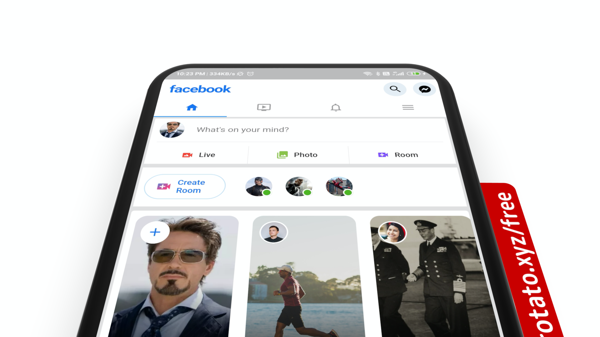
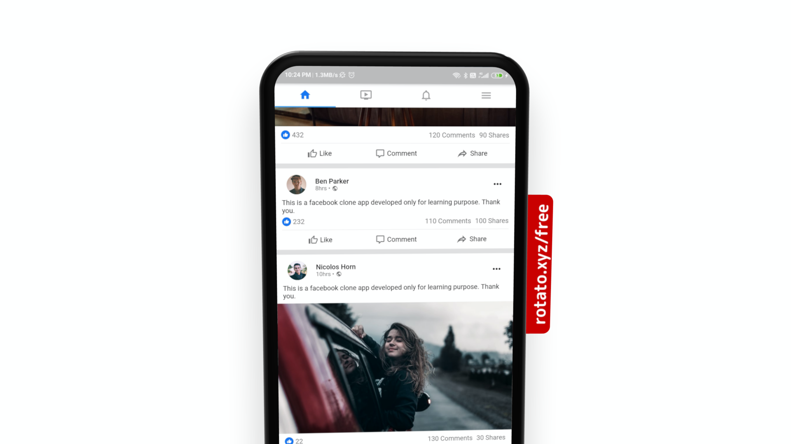

# Flutter Facebook Clone. 

Flutter Facebook Clone. 
This is a simple flutter application where I have clonned Facebook UI.
Created by [Joan Louji](https://joanlouji.web.app/)

## Installation

``` 

git clone https://github.com/sjlouji/FacebookClone-Flutter.git 
flutter pub get
flutter run 

```


## Demo

 <br>
 <br>
 <br>
 <br>
 <br>

Thank you for your support. 

## Get in touch with me

<h3>Where to find me</h3>
<p><a href="https://github.com/sjlouji" target="_blank"></a> <a href="https://twitter.com/Joanlouji" target="_blank"></a> <a href="https://www.linkedin.com/in/sjlouji" target="_blank"></a> <a href="https://medium.com/@sjlouji10" target="_blank"></a>
   <a href="https://joanlouji.web.app/" target="_blank"></a>
</p>

## Getting Started

A few resources to get started:

- [Lab: Write your first Flutter app](https://flutter.dev/docs/get-started/codelab)
- [Cookbook: Useful Flutter samples](https://flutter.dev/docs/cookbook)

For help getting started with Flutter, view our
[online documentation](https://flutter.dev/docs), which offers tutorials,
samples, guidance on mobile development, and a full API reference.
